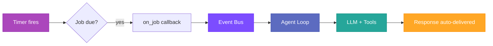
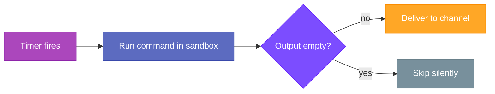

# Cron & Scheduled Tasks

Autobot includes a built-in scheduler for recurring checks, one-time reminders, and deferred tasks. Jobs fire as full agent turns with access to all tools.

---

## Overview

The cron system solves three common needs:

- **Reminders** — "Remind me to drink water in 30 minutes" (one-time deferred task)
- **Recurring reports** — "Send me a weather summary every morning at 9am" (cron expression)
- **Periodic tasks** — "Check my email every 5 minutes" (fixed interval)

When a job fires, it triggers a full agent turn — the agent can use MCP tools, web search, memory, and any other registered tools to complete the task. The response is automatically delivered to the user.

---

## Schedule Types

### Fixed Interval (`every_seconds`)

Runs repeatedly at a fixed interval.

```
"Check my email every 5 minutes"
→ every_seconds: 300
```

### Cron Expression (`cron_expr`)

Standard 5-field cron syntax: `MIN(0-59) HOUR(0-23) DOM(1-31) MON(1-12) DOW(0-6)`

Supports: `*` (any), ranges (`9-17`), steps (`*/5`), lists (`1,15,30`), combos (`1-30/10`), named months (`jan`-`dec`), named days (`mon`-`sun`), and shortcuts (`@hourly`, `@daily`, `@weekly`, `@monthly`, `@yearly`).

All values must be integers. Minimum granularity is 1 minute — for sub-minute intervals, use `every_seconds`.

```
"Send me a morning briefing at 9am"
→ cron_expr: "0 9 * * *"

"Every 5 minutes during work hours on weekdays"
→ cron_expr: "*/5 9-17 * * 1-5"
```

### One-Time (`at`)

Runs once at a specific time, then auto-deletes.

```
"Remind me at 3pm to call the dentist"
→ at: "2026-02-20T15:00:00Z"
```

---

## How It Works

### Job Execution Flow



1. **Timer fires** — The cron service detects a job is due
2. **Publish to bus** — An `InboundMessage` is published to the event bus with `channel: "system"` and `sender_id: "cron:{job_id}"`
3. **Agent turn** — The agent loop picks up the message and executes the job's prompt
4. **Tool execution** — The agent uses any tools needed (MCP, web search, etc.) to fulfill the task
5. **Explicit delivery** — The agent uses the `message` tool to send results to the user (no auto-delivery)

### Background Turn Restrictions

Cron turns use a minimal system prompt and exclude certain tools to prevent unintended behavior:

- **`spawn`** — excluded to prevent background task proliferation

Cron turns never auto-deliver the final response. The agent must use the `message` tool explicitly to notify the user. This enables **conditional delivery** — the agent can stay silent when there is nothing to report (e.g., "monitor X, only notify if Y changes"). A successful `message` call ends the turn, as does any tool listed in `tools.stop_after`.

The `cron` tool is available so jobs can self-remove when their task defines a stop condition (e.g., "monitor X until condition Y, then stop").

### Session context

Cron turns include the conversation history from the originating session, so the agent has context of previous interactions when executing the task. After execution, the cron exchange (task prompt + delivered message) is saved back to the session. This means followup questions from the user will naturally reference what the agent reported during the scheduled turn.

---

## Exec Payloads

Many monitoring and automation tasks are deterministic — check a URL, compare a value, send an alert. These don't need an LLM reasoning about what to do every time. But setting them up still requires figuring out the right shell command, cron expression, and wiring.

Exec payloads let you describe what you want in natural language — the agent writes the shell command once, and from that point on it runs directly on a schedule with zero LLM involvement. No tokens, no latency, no cost per execution.

> **User:** "Check air quality in NYC every hour, notify me if AQI goes above 100"
>
> The agent creates an exec job with the right `curl | jq` pipeline. Every hour the command runs on its own — the LLM is never called again.

### How exec differs from agent turns

| | Agent turn | Exec payload |
|---|---|---|
| **Setup** | LLM writes the prompt | LLM writes the shell command |
| **Each run** | Full LLM turn with tools | Shell command only |
| **Token cost** | Per-invocation | Zero (after setup) |
| **Output** | LLM-generated response | Raw stdout |
| **Best for** | Tasks needing reasoning | Deterministic checks and scripts |

### Parameters

- **`exec_command`** — The shell command to run (mutually exclusive with `message`)
- **`PREV_OUTPUT`** — Environment variable containing the previous run's stdout, enabling change detection

### Execution flow



Exec commands run inside the sandbox (bubblewrap or Docker) by default. Set `sandbox: none` to run directly on the host.

### Execution timeouts & limits

Command execution is bounded by a 30-second timeout by default in both sandboxed and direct (`sandbox: none`) modes. When a command exceeds the timeout, it is terminated, the job is marked as failed with a `command timed out` error, and it runs again on its next scheduled interval.

The timeout can be customized in `config.yml`:

```yaml
cron:
  exec_timeout: 60  # seconds (default: 30)
```

Output kept for `PREV_OUTPUT` is cut to 32 KB so it fits in the environment.

### Examples

**Air quality check (only notify on change):**

```bash
autobot cron add \
  --name "air-quality" \
  --exec 'curl -s "https://api.example.com/aqi?city=NYC" | jq -r .aqi' \
  --every 3600 \
  --channel telegram --to "12345"
```

The `PREV_OUTPUT` variable lets you detect changes:

```bash
autobot cron add \
  --name "uptime-monitor" \
  --exec 'STATUS=$(curl -so /dev/null -w "%{http_code}" https://example.com); [ "$STATUS" != "$PREV_OUTPUT" ] && echo "$STATUS" || true' \
  --every 300 \
  --channel slack --to "C12345"
```

**Disk space alert:**

```bash
autobot cron add \
  --name "disk-check" \
  --exec 'USAGE=$(df -h / | awk "NR==2{print \$5}" | tr -d "%"); [ "$USAGE" -gt 90 ] && echo "Disk usage: ${USAGE}%" || true' \
  --cron "0 */6 * * *" \
  --channel telegram --to "12345"
```

---

## Configuration

### Enable Cron

```yaml
cron:
  enabled: true
  store_path: "./cron.json"  # Optional, defaults to workspace
```

### Agent Creates Jobs

The agent creates cron jobs via the `cron` tool when users make scheduling requests. The tool supports three actions:

| Action | Description | Required Parameters |
|--------|-------------|---------------------|
| `add` | Create a new job | `message` + one of: `every_seconds`, `cron_expr`, `at` |
| `list` | List jobs for current owner | — |
| `show` | Show full job details | `job_id` |
| `update` | Update schedule or message in-place | `job_id` + at least one of: `message`, `every_seconds`, `cron_expr`, `at` |
| `enable` | Resume a paused job | `job_id` |
| `disable` | Pause a job without deleting it | `job_id` |
| `remove` | Delete a job | `job_id` |

---

## Telegram `/cron` Command

Send `/cron` in Telegram to instantly see all your scheduled jobs — no LLM round-trip needed.

**Example output:**

```
Scheduled jobs (2)

1. abc123 — Check GitHub stars
   ⏱ Every 10 min | ✅ 2 min ago

2. def456 — Morning briefing
   🕐 0 9 * * 1-5 (UTC) | ⏳ pending
```

Empty state shows: "No scheduled jobs. Ask me in chat to schedule something."

---

## Built-in Cron Skill

A built-in skill (`src/skills/cron/SKILL.md`) is automatically loaded when the cron tool is registered. It teaches the agent:

- **Message quality** — write self-contained prompts with specific tool names and URLs
- **Timezone handling** — ask the user, convert to UTC, confirm both times
- **Update-first rule** — list existing jobs before creating, update instead of duplicate
- **Schedule type selection** — when to use `every_seconds` vs `cron_expr` vs `at`

The skill declares `tool: cron` in its frontmatter, so it's included automatically whenever the cron tool is available — both in interactive and background turns.

---

## CLI Management

### List Jobs

```bash
autobot cron list        # Show enabled jobs
autobot cron list --all  # Include disabled jobs
```

### Show Job Details

```bash
autobot cron show <job_id>
```

### Add Jobs Manually

```bash
# Recurring interval
autobot cron add --name "standup" --message "Time for standup!" --every 3600

# Cron expression
autobot cron add --name "morning" --message "Good morning!" --cron "0 9 * * *"

# One-time
autobot cron add --name "reminder" --message "Call dentist" --at "2026-02-20T15:00:00Z"
```

### Update a Job

```bash
# Change schedule
autobot cron update <job_id> --cron "0 8 * * *"

# Change message
autobot cron update <job_id> --message "New task instructions"

# Change both
autobot cron update <job_id> --every 600 --message "Updated check"
```

### Remove a Job

```bash
autobot cron remove <job_id>
```

### Clear All Jobs

```bash
autobot cron clear
```

### Enable/Disable

```bash
autobot cron enable <job_id>
autobot cron disable <job_id>
```

### Force Run

```bash
autobot cron run <job_id>          # Run if enabled
autobot cron run <job_id> --force  # Run even if disabled
```

---

## Per-Owner Isolation

Jobs created via the `cron` tool are automatically scoped to the originating channel and chat. A Telegram user's jobs are isolated from a Slack user's jobs.

- **Owner format:** `channel:chat_id` (e.g., `telegram:634643933`)
- **List** only shows the current owner's jobs
- **Update** only works on the current owner's jobs
- **Remove** only works on the current owner's jobs
- Jobs created via CLI have no owner restriction

---

## Examples

### One-Time Reminder

User says: *"Remind me in 30 minutes to take a break"*

The agent creates:
```
cron add:
  message: "Send the user a reminder to take a break."
  at: "2026-02-20T10:30:00Z"
```

Job fires once, delivers the reminder, then auto-deletes.

### Daily Report

User says: *"Send me a weather summary every morning at 9am"*

The agent creates:
```
cron add:
  message: "Use web_search to find current weather for user's location.
            Send a brief summary."
  cron_expr: "0 9 * * *"
```

### Periodic Check

User says: *"Check my email every 5 minutes"*

The agent creates:
```
cron add:
  message: "Check email and notify the user of new messages."
  every_seconds: 300
```

### Update Existing Job

User says: *"Change my morning report to 8am instead"*

The agent updates:
```
cron update:
  job_id: "a1b2c3d4"
  cron_expr: "0 8 * * *"
```

Job identity (`id`, `created_at_ms`, `state`) is preserved — only the schedule changes.

---

## File Structure

```
workspace/
└── cron.json    # Job definitions (auto-created)
```

**Permissions:**

- `cron.json`: `0600` (user read/write only)
- Parent directory: `0700` (user-only access)

---

## Troubleshooting

### Job doesn't fire

**Check:**

1. Is cron enabled in config? (`cron.enabled: true`)
2. Is the job enabled? (`autobot cron show <job_id>`)
3. Is the gateway running? (Jobs only fire while the gateway process is active)
4. Check logs for `Cron: executing job` entries

---

## See Also

- [Architecture](architecture.md) — System design and message flow
- [Configuration](configuration.md) — Full config reference
- [Security](security.md) — File permissions and job isolation
